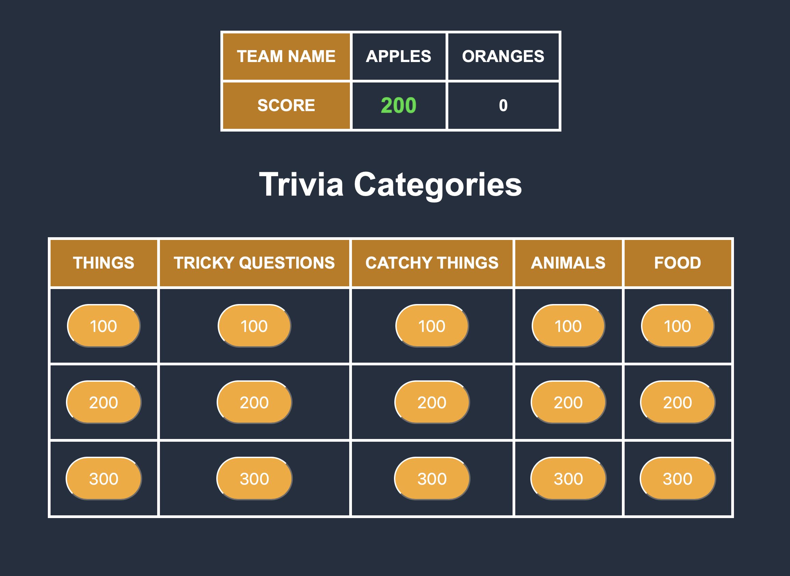
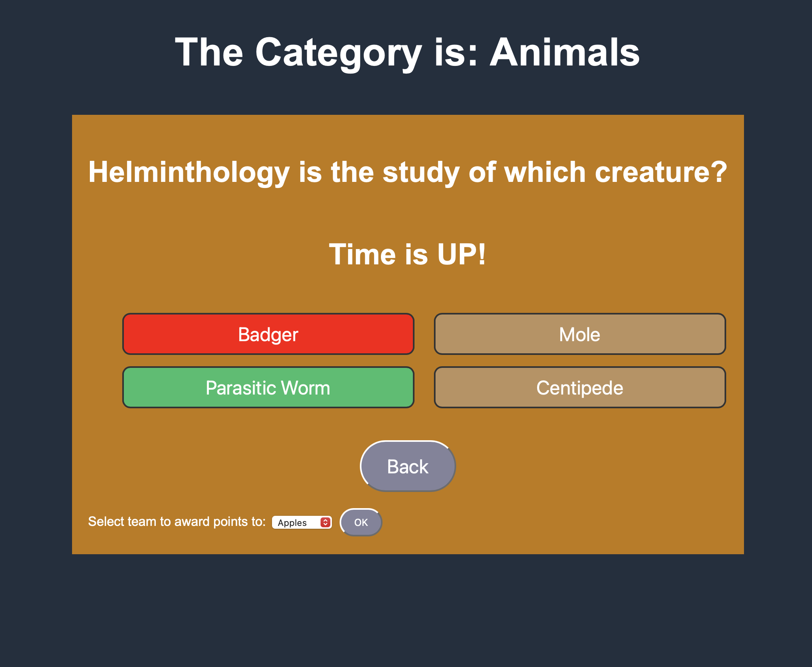
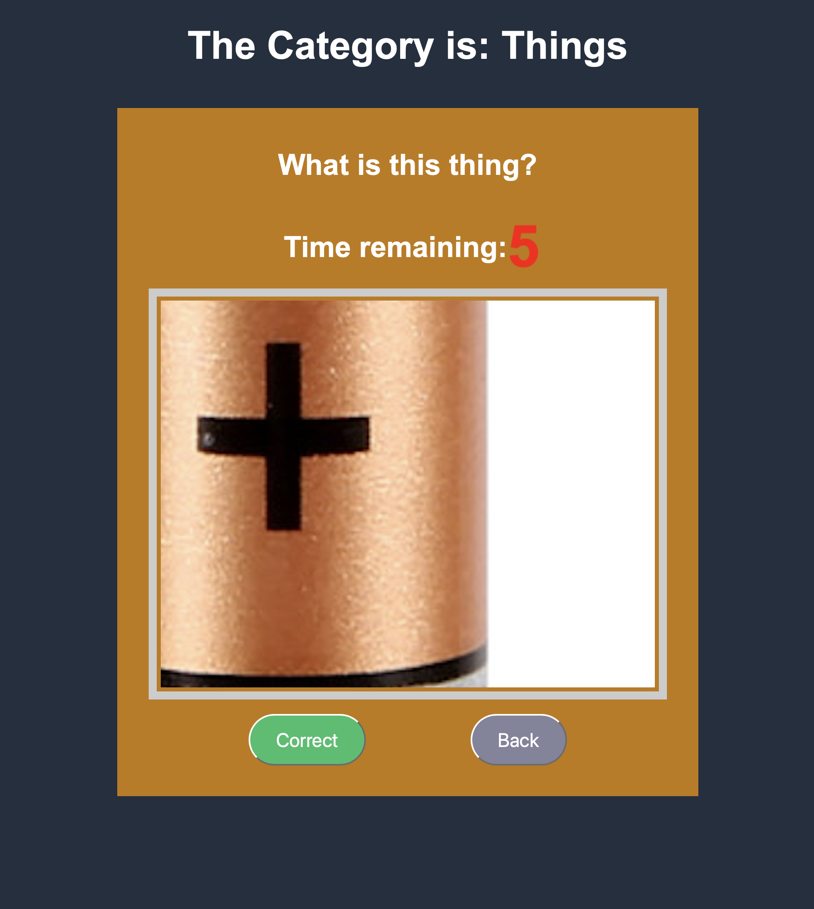
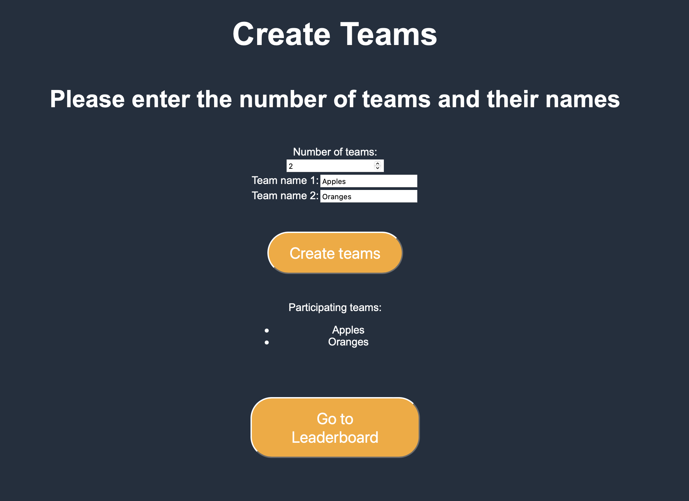

# Trivia App

Welcome to the Trivia App! This project is a web-based trivia application where anyone can create and run their own trivia games. It provides a platform for running trivia events with functionalities of adding different categories that include questions based on text, images, with or without multiple choice option and etc. The included questions serve as examples to demonstrate the functionality of the app, but you can easily customize them to suit your own trivia content.

## Features

- Create and manage custom trivia games with your own set of questions.
- Create your own trivia categories, multiple choice-questions, add images and more
- Add multiple teams with custom names for each trivia game
- Real-time timer to add excitement and pressure to each question.
- Interactive user interface for displaying questions and collecting answers.
- Automatic scoring and leaderboard to track participant scores.

Here are examples of possible questions:
1. Multiple choice

2. An image-based question

## Technologies Used

- HTML, CSS, and JavaScript for the frontend development.
- Local storage for data persistence.

## Getting Started

To get started with the Trivia App, follow these steps:

1. Clone the repository to your local machine.
2. Open the project in your preferred code editor.
3. Customize the questions and categories in the `questions.js` file to match your trivia content.
4. Run a Python server using the following command `python -m http.server`.
5. Launch the app by opening the `create-teams.html` file in your web browser.
6. Create teams at `localhost:[port number]/create-teams.html`

7. Go to the leaderboard, then go to the trivia main page from there, the trivia categories will be displayed (see intro image).
